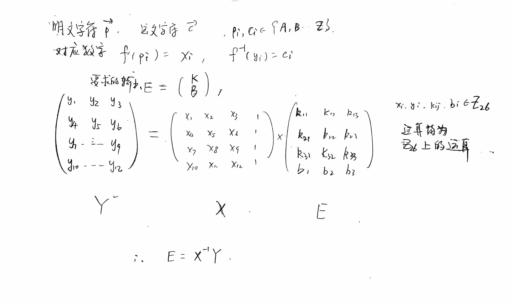

## **现代密码学实验报告**

| 实验名称：古典密码设计与分析 | 实验时间：2024-10-01 |
| ---------------------------- | -------------------- |
| 学生姓名：庄云皓             | 学号：22336327       |
| 学生班级：22级保密管理       | 成绩评定：           |

---

## **实验1-1 维吉尼亚密码分析**

### **实验目的**

给定密文，通过指数重合法找出密钥得到明文。

通过实现维吉尼亚密码的密文分析，理解加密算法的原理，学习维吉尼亚密码分析方法，提高对古典密码学攻击方法的认识和应用能力。

### **实验内容**

用 C/C++ 实现维吉尼亚密码解密

  **输入**:密文，只包含 ASCII 可打印字符（包括各种标点符号），明文的内容来自已有的英语文本（不是随机生成的字符串或 `Lorem ipsum`），密文和密钥的长度至少为 50:1。

  **输出** :密钥和明文

### **实验原理**

已知密钥长度不会超过密文1/50，使用找到重合指数$I_c$为串中两个随机元素相同的概率

我们从一个密文字符串 $y = y_1y_2 \ldots y_n$ 开始，该字符串是通过使用维吉尼亚密码构建的。通过以列的方式将密文写成一个 $m \times (n/m)$ 的矩形，定义 $y$ 的 $m$ 个子字符串，表示为 $y_1, y_2, \ldots, y_m$。该矩阵的行是子字符串 $y_i$，其中 $1 \leq i \leq m$。换句话说，我们有：

- $y_1 = y_1y_{m+1}y_{2m+1} \ldots$
- $y_2 = y_2y_{m+2}y_{2m+2} \ldots$
- $\ldots$
- $y_m = y_my_{2m}y_{3m} \ldots$

如果按照这种方式构造 $y_1, y_2, \ldots, y_m$，并且 $m$ 确实是关键字的长度，那么每个值 $I_c(y_i)$ 应该大致等于 $0.065$。另一方面，如果 $m$ 不是关键字的长度，那么子字符串 $y_i$ 看起来会更加随机，因为它们是通过不同密钥的移位加密获得的。注意，一个完全随机的字符串将具有：

$I_c \approx \frac{26}{26^2} = \frac{1}{26} = 0.038$。

假设我们已经确定了正确的值 $m$，那么我们如何确定实际的密钥 $K = (k_1, k_2, \ldots, k_m)$ 呢？令 $1 \leq i \leq m$，让 $f_0, \ldots, f_{25}$ 表示字符串 $y_i$ 中 A、B、...、Z 的频率，同时令 $n = n/m$ 表示字符串 $y_i$ 的长度。那么 $y_i$ 中 26 个字母的概率分布为 $f_0/n, \ldots, f_{25}/n$。

子字符串 $y_i$ 是通过使用移位 $k_i$ 对明文元素的子集进行移位加密而获得的。因此，我们希望移位后的概率分布 $f_{k_i}/n, \ldots, f_{25+k_i}/n$ 与表 2.1 中列出的理想概率分布 $p_0, \ldots, p_{25}$ “接近”，其中上述公式中的下标按模 26 进行计算。

假设 $0 \leq g \leq 25$，定义量
$M_g = \sum_{i=0}^{25} p_i f_{i+g}/n$

如果 $g = k_i$，那么我们期望
$M_g \approx \sum_{i=0}^{25}$$pi^2 = 0.065$，就像考虑重合指数一样。如果 $g = k_i$，那么 $M_g$ 通常会明显小于 0.065.能够帮助我们确定每个 $i$ 值（$1 \leq i \leq m$）的正确 $k_i$ 值。

### **实验步骤（源代码）**

+ **预处理部分**：只保留字母部分并转为小写

```cpp
    string text;
    string word;
    //期望概率
    double pr[26] = {0.0726, 0.0027, 0.0403, 0.0403, 0.1371, 0.0188, 0.0323, 0.0349, 0.0806, 0.0054, 0.0027, 0.0403, 0.0403, 0.0968, 0.0565, 0.0215, 0.0027, 0.0565, 0.0538, 0.0968, 0.0403, 0.0054, 0.0027, 0.0027, 0.0108, 0.0054};
    //unordered_map<string, int> maps;
  
    // 读取标准输入，直到EOF（End Of File） 解析为密文字符串

    while(cin>>word){
        text += word+' ';
    }

    //预处理
    string low_text = text;

    for (size_t i = 0; i < low_text.size(); i++)
    {
        if(!((low_text[i] <='Z' && low_text[i] >= 'A')||(low_text[i] <='z' && low_text[i] >= 'a'))){
            low_text.erase(i,1);
            i--;
        }
    }
    //转换为小写
  
    for (size_t i = 0; i < low_text.size(); i++){
        if(low_text[i] >= 'A' && low_text[i] <= 'Z'){
            low_text[i] = low_text[i] - 'A' + 'a';
        }
    }
```

+ **获取密钥长度**： 函数 `getKeyLen`，用于通过重合指数分析来获取密钥长度。首先，它计算输入文本的长度除以50的商作为 `temp_len`。然后，创建一个整型向量 `v`，将从2到 `temp_len` 的整数依次存入其中，作为备选的密钥长度列表。接下来，对于每个可能的密钥长度 `num`，函数执行以下操作：创建一个二维向量 `freq` 用于记录每个分组内字母的频率，将输入文本按照规则分组，并计算每组内各字母出现的频率。然后，对每个分组内的频率进行归一化处理，计算频率的平方，并计算每个分组的重合指数，求得其均值 `mean`。如果均值 `mean` 大于0.065，则将其设为 `max_mean`，并将当前的 `num` 设为 `key_len`，然后终止循环。最终，函数返回计算得到的密钥长度。该函数的目的是找到使得重合指数最大的密钥长度，以帮助进一步破译密码。

```cpp
int getKeyLen(string low_text){
 
    int temp_len = low_text.size()/50;
    vector<int> v;
    for(int i = 2; i <= temp_len; i++){
        v.push_back(i);
    }
    double max_mean = 0;
    int key_len = 0;
    for(int i = 0; i < v.size(); i++){
        int num = v[i];
        vector<vector<double> > freq(num,vector<double>(26,0));

        string str;
        //去出下标为0,0+num,0+2num的元素
        for(int j = 0; j<low_text.size(); j+=1){
            //printf("%c\n",low_text[j]);
            freq[j%num][int(low_text[j]-'a')]+=1;
        }
  
        //除以总数得到频数
        for(int k=0; k<freq.size();k++){
            double sum = getSum(freq[k]);
            for(int j = 0; j<freq[0].size();j++){
                freq[k][j]/=sum;
                freq[k][j] *= freq[k][j];
            }
        }
        //计算n-1个重合指数的均值
        double mean=0;
        for(int i = 0;i<freq.size();i++){
            mean+= getSum(freq[i]);
        }
        mean/=freq.size();

        if(mean>max_meam){
            max_mean = mean;
            key_len = num;
            break;
        }
    }
    //cout<<"key_len="<<key_len<<endl;
    return key_len;
}

```

+ **得到密钥**：知道密钥长度以后，对于一个分组 $\pmb{y_i}$ 计算$M_g(\pmb{y_i})$，找到使得$M_g(\pmb{y_i})$最大的g，得到密钥$k_i=g$

```cpp
    string key;
    for(int i = 0; i<key_len; i++){
        double max_Mg = 0;
        int id = 0;
        vector<double> f(26,0);
        //获取组中字母频率
        for(int j=i;j+i<low_text.size();j+=key_len){
            f[low_text[j]-'a']+=1;
        }
        double sumj = getSum(f);

        for(int j=0;j<f.size();j++){
            f[j]/=sumj;
        }
        //计算M_g
  
        for(int  g= 0; g<26; g++){
            double Mg=0;
            for(int i = 0;i<26;i++){
                Mg+=pr[i]*f[(i+g)%26];
            }
            if(Mg>max_Mg){
                max_Mg=Mg;
                id = g;
            }
             //cout<<Mg<<" ";
        }
        //cout<<"Max_Mg="<<max_Mg<<endl;
        key.push_back('A'+id);
   
    }
```

+ **获取最小长度的密钥**：密钥可能是子串的重复。使用KMP求得最小长度的密钥
+ **解密得到明文**：通过循环遍历输入文本 text 的每个字符，i,j分别是密文和经过预处理之后的密文的下标。对于每个字符，如果是小写字母，则执行以下操作：将其解密为明文字符，具体步骤是将密文字符减去对应密钥字符的偏移量，并根据情况重新映射到小写字母的 ASCII 范围；如果是大写字母，则执行类似的解密操作，但是映射到大写字母的 ASCII 范围；如果是非字母字符，则跳过继续下一个字符的解密。每解密一个字符， j 自增以继续解密下一个字符。

```cpp
if(text[i]>='a'&&text[i]<='z'){
    text[i] = ((low_text[j]+26-(key[j%key_len]-'A'))%97)%26+97;
    else if(text[i]>='A'&&text[i]<='Z')
    text[i] = ((low_text[j]+26-(key[j%key_len]-'A'))%97)%26+65;
    else
    continue;

    j++;
  
}
cout<<text;
  
```

### **思考题**

### **实验总结**

通过这次实验，我深入了解了维吉尼亚密码的原理，并掌握了如何使用编程语言实现维吉尼亚密码的加密和解密。通过编写代码，我能够更好地理解密码学的概念和算法，我也学会了如何使用KMP算法来找到最小长度的密钥。认识到统计分析方法在解密中的作用。

---

## **实验1-2 仿射希尔密码分析**

### **实验目的**

通过实现仿射希尔密码，理解其加解密算法，提高对古典密码学认识。

### **实验内容**

用C/C++ 编程实现仿射希尔密码的密文分析，在已知明文和密文的情况下求出密钥。

**输入**:

* m 的值(即加密密钥矩阵的维度)
* 明文
* 密文
  * 均仅包含大写字母，长度是 m 的倍数且至少为$2m^2$

**输出** :

* m×m 矩阵 L 的内容
* m 长度向量 b 的内容
  * 均为 $Z_{26}$的整数

### **实验原理**

用当m为3时的一个例子说明



### **实验步骤（源代码）**

+ **预处理部分**：
  将明文和密文转换为对应的数值矩阵
  + X为一个$(m+1)\times (m+1)$维的矩阵，可知其元素个数小于 `2m^2` ，我们将明文按行优先顺序填充进矩阵，最后一列为1(矩阵相乘时b的系数为1)

```cpp
    vector<vector<int> > X(m+1,vector<int>(m+1,1));
    for(int i = 0; i < m*(m+1); i++){
        X[i/m][i%m] = plain_text[i] - 'A';
    }
    vector<vector<int> > Y(m+1,vector<int>(m));
    for(int i = 0; i < m*(m+1); i++){
        Y[i/m][i%m] = cipher_text[i] - 'A';
    }
```

在例1中

X:

```
0 3 8 1
18 15 11 1
0 24 4 1
3 4 16 1
```

Y:

```
3 18 17
12 18 8
14 15 11
23 11 9
```

+ **计算$X^{-1}$**

通过计算行列式和伴随矩阵方式实现：
数学公式为：

$$
X^{-1} = {\det(X)^{-1}}adj(X)
$$

其中，$\det(X)$为X的行列式，adj(X)为X的伴随矩阵

```cpp
// 计算行列式
int getDet(const vector<vector<int>>& arr) {
    int n = arr.size();
    if (n == 1) return arr[0][0];
    if (n == 2) return mod(arr[0][0] * arr[1][1] - arr[0][1] * arr[1][0]);

    int det = 0;
    for (int i = 0; i < n; i++) {
        vector<vector<int>> subMatrix(n - 1, vector<int>(n - 1));
        for (int j = 1; j < n; j++) {
            for (int k = 0, l = 0; k < n; k++) {
                if (k == i) continue;
                subMatrix[j - 1][l++] = arr[j][k];
            }
        }
        det = mod(det + arr[0][i] * pow(-1, i) * getDet(subMatrix));
    }
    return det;
}

// 计算伴随矩阵
vector<vector<int>> getAdjoint(const vector<vector<int>>& arr) {
    int n = arr.size();
    vector<vector<int>> adj(n, vector<int>(n));
    for (int i = 0; i < n; i++) {
        for (int j = 0; j < n; j++) {
            vector<vector<int>> subMatrix(n - 1, vector<int>(n - 1));
            for (int k = 0, p = 0; k < n; k++) {
                if (k == i) continue;
                for (int l = 0, q = 0; l < n; l++) {
                    if (l == j) continue;
                    subMatrix[p][q++] = arr[k][l];
                }
                p++;
            }
            adj[j][i] = mod(pow(-1, i + j) * getDet(subMatrix));
        }
    }
    return adj;
}

// 计算逆矩阵
vector<vector<int>> inverse(const vector<vector<int>>& arr) {
    int det = getDet(arr);
    int invdet = modInverse(det, 26);
    vector<vector<int>> adj = getAdjoint(arr);
    for (auto& row : adj) {
        for (int& val : row) {
            val = mod(val * invdet);
        }
    }
    return adj;
}
  
```

其中，模运算定义为：

```cpp
int mod(int a) {
    return (a % 26 + 26) % 26;
}
```

求逆元运算定义为：

```cpp
int modInverse(int a, int mod) {
    a = a % mod;
    for (int x = 1; x < mod; x++) {
        if ((a * x) % mod == 1) {
            return x; // Found the modular inverse
        }
    }
    fprintf(stderr, "Modular inverse doesn't exist\n");
    exit(EXIT_FAILURE);
}
```

```cpp
vector<vector<int>> X_1 = inverse(X);
```

计算结果为

$X^{-1}$:

```
12 6 9 25
13 2 23 14
23 17 10 2
12 14 7 20
```

+ **最后，$E = X^{-1}Y =\begin{pmatrix} K; \\ B \\ \end{pmatrix} $**

```cpp
vector<vector<int> > multiply(const vector<vector<int> >& A, const vector<vector<int> >& B) {
    int n = A.size();
    if (A[0].size() != B.size()) {
        throw invalid_argument("Matrix dimensions do not match for multiplication.");
    }
    int m = B[0].size();
    vector<vector<int> > C(n, vector<int>(m, 0));
    for (int i = 0; i < n; i++) {
        for (int j = 0; j < m; j++) {
            for (int k = 0; k < A[0].size(); k++) {
                C[i][j] = (C[i][j] + A[i][k] * B[k][j]) % 26;
            }
        }
    }
    return C;
}

vector<vector<int>> K = multiply(X_1, Y);
```

结果为

E:

```
3 6 4
5 15 18
17 8 5
8 13 1
```

### **实验总结**

通过本次实验，我深入理解了仿射希尔密码的加密和解密过程，掌握了$Z_{26}^{n^2}$上矩阵运算的基本方法，如矩阵乘法、行列式计算、伴随矩阵计算和逆矩阵计算。
同时，我也学会了如何使用C++语言实现这些算法，并解决了在实现过程中遇到的一些问题。通过本次实验，我对矩阵加密和解密有了更深入的理解，也提高了我的编程能力和解决问题的能力。
