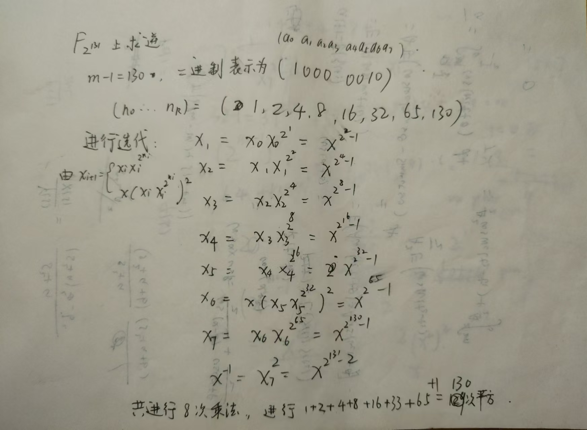
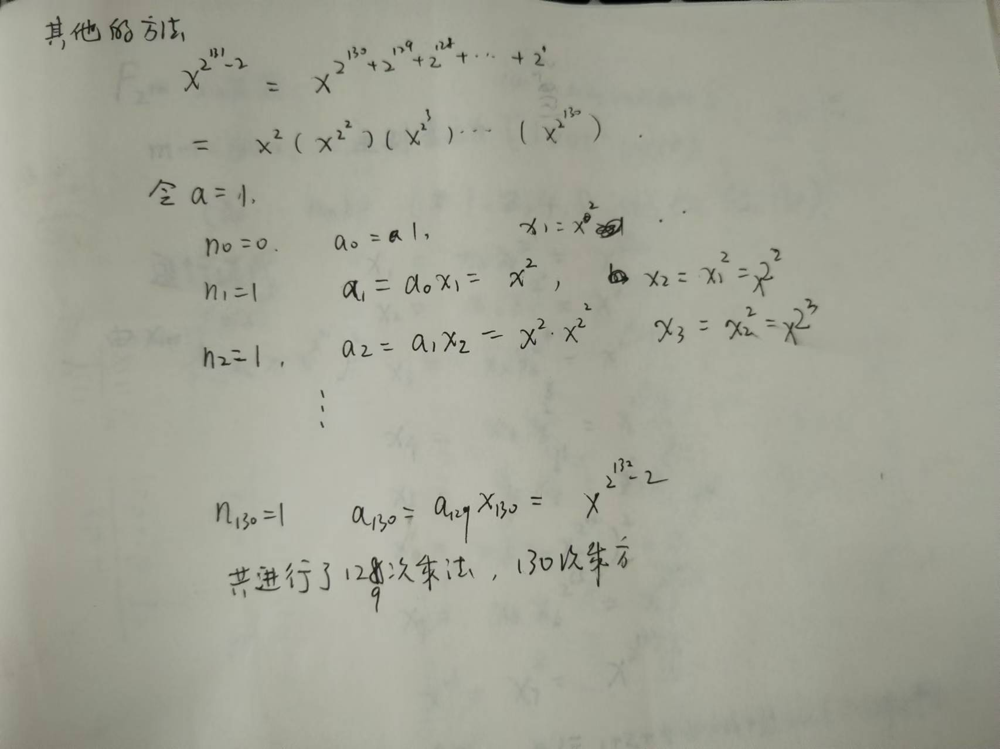

# **现代密码学实验报告**

| 实验名称：             | 实验时间：2024-10-23 |
| :--------------------- | -------------------- |
| 学生姓名：庄云皓       | 学号：22336327       |
| 学生班级：22级保密管理 | 成绩评定：           |

# **实验 2-1：有限域运算**

### **实验目的**

通过实现有限域$ F_{131}$上的加法、乘法、平方和求逆运算，理解有限域上运算的流程，并进行性能优化。

### **实验内容**

用C/C++ 实现有限域$ F_{131}$上的加法、乘法、平方和求逆运算

**输入**:

输入由以下部分组成：

* `uint32_t` 需要进行的运算数量
* 若干个运算操作

  * `uint8_t` 进行的运算类型
    * `0x00` 加法
    * `0x01` 乘法
    * `0x02` 平方
    * `0x03` 求逆
  * `uint64_t[3][2]` 进行运算的两个有限域元素
    * 平方和求逆不是二元运算，请忽略第二个元素

  **输出** ：将每次运算的结果以 `uint64_t[3]`，不使用的高位需要全部设为 `0`

### **实验原理**

加法，最简单的异或运算

乘法进行了优化。对于小学简单乘法，也就是乘数每一位与被乘数乘，将所有结果相异或，

进行优化后，采用karasuba算法将192位拆到PCLMULQDQ指令可以处理的64位然后再乘。

平方采用位运算进行优化实现,用比特串表示的话，b[2*i]=a[i],再对b取模得到结果。

求逆采用两种方法实现，扩展欧几里得算法和费马小定理算法。**提交序号分别为1228和1230**

### **实验步骤（源代码）**

这里的代码采用bitset存，运算的过程参考了[F(2^131)下有限域基本运算的实现(c++)_有限域运算编程-CSDN博客](https://blog.csdn.net/qq_36473502/article/details/83246617)，但是做了一些改动，具体见下。

+ **预处理部分**：
  将输入用bitset<192>容器去存,

```cpp
#define gf bitset<M>
#define gf2 bitset<2*M>
	gf ax,bx;
        for(int i = 0;i < 24;i++){
            fread(&byte,1,1,inputFile);
            for(int j = 0;j < 8;j++){
                ax[i * 8 + j] = (byte >> j) & 1;
  
            }
        }
```

例如，

```
05 20 00 00 00 00 00 00
00 00 00 00 00 00 00 00
00 00 00 00 00 00 00 00
```

对应的ax我们cout一下，bitset最低位就是多项式系数a_0,以此类推

```
000000000000000000000000000000000000000000000000000000000000000000000000000000000000000000000000000000000000000000000000000000000000000000000000000000000000000000000000000000000010000000000101
```

+ **加法：**
  简单异或即可

```cpp
void gf_add(gf &cx, gf ax, gf bx){
    for(int i = 0;i < ax.size();i++){
        cx[i]=ax[i] ^ bx[i];
    }
}
```

+ **乘法：**
  naive乘法，也就是简单的小学竖式乘法

```cpp
void gf_mul(gf &c, const gf a, const gf b)
{

    bitset<2 * M> x;
    bitset<2 * M> temp(a.to_string());
    for (int i = 0; i < 131; i++)
    {
        if (b[i])
            x ^= temp << i;
    }
    c = mod(x, p);

}
```

我们对乘法进行优化，采用karasuba算法,但是注意递归不要过深，只用递归到SIMD指令可以处理的位数就可以了:

karasuba算法的原理如下：假设两个大数x,y;
a,b,c,d分别是x,y二进制表示的高n/2位和低n/2位，那么x,y可以表示为$a∗2^{n/2}+b$和$c∗2^{n/2}+d$

$x∗y =(a∗2^{n/2}+b)∗(c∗2^{n/2}+d) = ac∗2^{n}+(ad+bc)∗2^{n/2}+bd = ac∗2^{n}+[(a+b)∗(c+d)−ac−bd]∗2^{n/2}+bd$

```cpp
//使用karatsuba算法实现乘法优化
void gf_mul_karatsuba(gf &c, const gf a, const gf b, int n)
{
    bitset<2 * M> temp;
    if (n<=64)
    {

        __m128i a1 = _mm_set_epi64x(0, a.to_ullong());
        __m128i b1 = _mm_set_epi64x(0, b.to_ullong());
        __m128i c1 = _mm_clmulepi64_si128(a1, b1, 0x00);

        char data_array[16];
        _mm_storeu_si128((__m128i*)data_array, c1);


        // 将数组中的每个元素放入 bitset
        for (int i = 0; i < 16; ++i) {

            for(int j = 0; j<8;j++){
                c[i*8+j] = (data_array[i] >> j) & 1;
            }
  
        }
  

        return;
    }
    else
    {
        gf a1, a0, b1, b0;
        int n2 = n / 2 ;

        a1 = a >> n2; //取高n/2位
        for(int i = 0;i < n2;i++)
            a0[i] = a[i];
        b1 = b >> n2;
        for(int i = 0;i < n2;i++)
            b0[i] = b[i];
        gf z0;
        gf_mul_karatsuba(z0, a0, b0, n2);
        gf z1;
        gf_mul_karatsuba(z1, a1^a0, b1^b0, n-n2);
        gf z2;
        gf_mul_karatsuba(z2, a1, b1, n-n2);

        z1 = z1 ^ z2 ^ z0;

        bitset <2*M> t1(z0.to_string());
        bitset <2*M> t2(z1.to_string());
        bitset <2*M> t3(z2.to_string());
        temp = t1 ^ (t2 << n2) ^ (t3 << 2 * n2);

  
        c = mod(temp);

    }

}


```

+ **模运算实现：**

[F(2^131)下有限域基本运算的实现(c++)_有限域运算编程-CSDN博客](https://blog.csdn.net/qq_36473502/article/details/83246617)的代码在求模运算中存在问题，我重新写了一个，思路如下：

函数 mod 实现了多项式模运算，通过不断将输入多项式 a，通过将不可约多项式r左移将最高位与a最高位对其进行异或操作，这样就可以不断消去a最高位的1，直到 a 的度数小于 r 的度数，最终返回 a 的后 M 位作为模运算的结果。

```cpp
bitset<M> mod(bitset<2 * M> a) {
  

    for (int i = 2 * M - 1; i >= 131; --i) {
        if (a[i]) {
            a = a ^ (r << (i - 131));
        }
    }

    bitset<M> result;
    for (int i = 0; i < 131; ++i) {
        result[i] = a[i];
    }
    return result;
}
```

+ **平方：**

方法1：直接调用乘法函数

```cpp
void gf_pow2(gf &cx, gf ax){
    gf_mul(cx,ax,ax);
}
```

方法2：采用位运算实现

  平方相当于将每个位移到原来位置的2倍，然后对不可约多项式取模

```cpp
void gf_pow2(gf &cx, gf ax){

    bitset<2 * M> x;
    for (int i = 0; i < M; i++)
        x[i * 2] = ax[i];
    cx = mod(x);
}
```

+ **求逆：**

扩展欧几里得算法：要求a(x)^-1 mod p(x)=1通过辗转相除法求求到gcd(a(x),p(x))=1,过程为gcd(a(x),p(x)) = gcd(p(x), a(x)%p(x)),然后逐步回代，最后与a(x)相乘的多项式为所求逆元

```cpp
void gf_inv(gf &cx ,const gf a)
{

    bitset<2 * M> b, c, u, v, temp;
    bitset<M> r(p.to_string().substr(1));
    int j;
    b[0] = 1;
    u = bitset<2 * M>(a.to_string());
    v = p;
    while (degree(u))
    {
        j = degree(u) - degree(v);
        if (j < 0)
        {
            j = -j;
            temp = u;
            u = v;
            v = temp;
            temp = b;
            b = c;
            c = temp;
        }
        u = u ^ (v << j);
        b = b ^ (c << j);
    }
    cx = mod(b);
}
```

使用费马小定理求逆元，按照实验网站公式来推，推导过程在思考题部分：

```cpp
void gf_inv1(gf &cx ,const gf a){
    //使用费马小定理求逆元
    //x1
    gf_pow2(cx,a);
    gf_mul(cx,cx,a);
    gf x1 = cx;
    //x2
    gf_pow2(cx,cx);
    gf_pow2(cx,cx);
    gf_mul(cx,cx,x1);
    gf x2 = cx;
    //x3
    for(int i = 0; i<4;i++){
        gf_pow2(cx,cx);
    }
    gf_mul(cx,cx,x2);
    gf x3 = cx;
    //x4
    for(int i = 0; i<8;i++){
        gf_pow2(cx,cx);
    }
    gf_mul(cx,cx,x3);
    gf x4 = cx;
    //x5
    for(int i = 0; i<16;i++){
        gf_pow2(cx,cx);
    }
    gf_mul(cx,cx,x4);
    gf x5 = cx;
    //x6
    for(int i = 0; i<32;i++){
        gf_pow2(cx,cx);
    }
    gf_mul(cx,cx,x5);
    gf_pow2(cx,cx);
    gf_mul(cx,cx,a);
    gf x6 = cx;

    //x7

    for(int i = 0; i<65;i++){
        gf_pow2(cx,cx);
    }
    gf_mul(cx,cx,x6);
    //x7^2
    gf_pow2(cx,cx);

    return;


}
```

另一种方法实现费马小定理求逆元的代码为：

```cpp
void gf_inv2(gf &cx ,const gf a){
    //使用费马小定理求逆元,方法2
    cx = a;
    for(int i = 1;i<130;i++){
        gf_pow2(cx,cx);
        gf_mul(cx,cx,a);
    }
    gf_pow2(cx,cx);

}
```

推导过程同样见思考题

### **思考题**



进行一次乘法平均需要 2377.601 ms/500k = 0.004755202ms

一次求平方运算需要1670.473 ms/500k = 0.003340946ms

一次求逆运算需要 6046.727ms/20k=0.30233635ms

130 * 0.003340946ms + 8 * 0.004755202ms=0.472364596ms，与一次求逆运算时间接近



实际一次求逆时间为14615.29ms/20k=0.7307645ms

预期求逆时间为0.004755202*129+0.003340946 *130ms=1.047744038ms

### **实验总结**

通过这次实验我了解了有限域上运算的实现，首先匹配输入输出格式就花了很长的时间，思考用什么数据结构去存多项式系数也尝试了许多种，最后使用了bitset来存，运算过程先使用了最简单的过程，然后逐步进行优化，主要优化了乘法和平方的计算。
