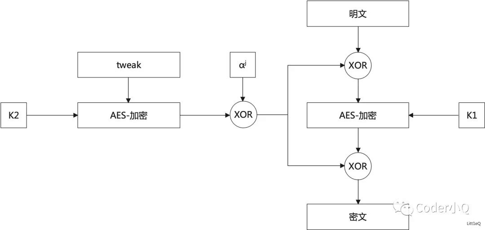

# **现代密码学实验报告**

| 实验名称：AES-128的实现 | 实验时间：2024-11-20 |
| :---------------------- | -------------------- |
| 学生姓名：庄云皓        | 学号：22336327       |
| 学生班级：22级保密管理  | 成绩评定：           |

## **实验3 AES-128的实现**

### **实验目的**

通过实现AES加密和解密，理解分组密码实现的过程，提高密码设计与分析的能力。

### **实验内容**

用C/C++ 实现AES加密和解密

输入：

* `uint8_t` 工作模式和加密/解密
  * `0x01` 表示 CBC 模式加密
  * `0x81` 表示 CBC 模式解密
  * 最高位为 0 表示加密，1 表示解密
* `uint8_t[16]` 密钥
* `uint8_t[16]` IV
* `uint32_t` 明文/密文长度len
* `uint8_t[]` 明文/密文内容

输出：加密后的密文/解密后的明文。

注意输入和输出的填充和去除填充，填充pad_len个字节，pad_len=16-len%16,填充值为(char)pad_len。

解密的时候，根据解密后读出的最后的字符得到pad_len的值去除pad_len个字符得到最终结果。

自己实现的版本提交序号：


后再编写使用 AES-NI 的版本


### **实验原理**

将明文分组对每16个字节x,加密函数$e_K$如下

* 给定 x，将变量 State 初始化为 x，并执行操作 ADD_ROUNDKEY，将 RoundKey 与 State 进行异或。
* 对于前 N - 1 轮中的每一轮，执行一个称为 SUBBYTES 的替代操作，使用 S 盒对 State 进行处理；对 State 执行置换操作 SHIFTROWS；对 State 执行操作 MIXCOLUMNS；并执行 ADD_ROUNDKEY。
* 执行 SUBBYTES；执行 SHIFTROWS；并执行 ADD_ROUNDKEY。
* 将密文 y 定义为 State。

采用CBC工作模式


其中$x_i$为明文分组，$y_i(i>=1)$为密文分组，$C_i$为密文分组，$IV$为初始化向量，$e_K$为加密函数，$d_K$为解密函数。$d_K$为$e_K$的逆过程。

加密过程中，每一小段与初始块或者上一段的密文段进行异或运算后，再与密钥进行加密。

解密过程在输出明文前要与IV或上一个密文块做异或再输出。

### **实验步骤（源代码）**

+ **预处理部分**：读取key，IV，进行密钥扩展得到w, 对明文进行分组输入，不要一次性把所有的明文读入，这样当明文长度大于给程序分配的内存容量是会产生memory limit exeeded错误。

```cpp
    uint8_t op;
    uint8_t key[4][4],iv[4][4];
    int len;//plainText的长度
    unsigned char* plain_text;

    fread(&op, 1, 1, inputFile);

    for(int i = 0; i < 4; i++)
        for(int j = 0; j < 4; j++)
            fread(&key[j][i], 1, 1, inputFile);
    for(int i = 0; i < 4; i++)
        for(int j = 0; j < 4; j++)  
            fread(&iv[j][i], 1, 1, inputFile);  
  

    fread(&len, 4, 1, inputFile);
    // //密钥扩展
    uint8_t w[176];
    keyExpansion(w,key);
    // print(w,176);
    unsigned char* chipher_text;
```

+ **密钥扩展：** w的前16个字节就是key，后面的字节由前16个字节通过轮函数得到，轮函数包括字循环，字节替换，轮常量异或，列混淆。


```cpp
void keyExpansion(uint8_t w[176],uint8_t key[4][4]){
    //unsigned char Rcon[11] = {0, 1, 2, 4, 8, 16, 32, 64, 128, 27, 54};
    for(int i=0;i<4;i++){
        for(int j=0;j<4;j++){
            w[i*4+j]=key[j][i];
        }
    }
    uint8_t temp[4];
    for(int i=16;i<176;i++){
        if(i%4==0)
        for(int j=0;j<4;j++){
            temp[j]=w[i-4+j];
        }
        if(i%16==0){

            RotateWord(temp);
            SubWord(temp);

            for(int j=0;j<4;j++){
                temp[j]=temp[j]^Rcon[i/16][j];
        }
        }

            w[i]=w[i-16]^temp[i%4];
    }
}
```

字替换函数如下：

```cpp
void SubWord(uint8_t w[4]){
    for(int i=0;i<4;i++){
        w[i]=S_BOX[w[i]>>4][w[i]&0x0f];
    }
}
```

字循环函数如下：

```cpp
void RotateWord(uint8_t w[4]){
    uint8_t temp=w[0];
    w[0]=w[1];
    w[1]=w[2];
    w[2]=w[3];
    w[3]=temp;
}
```

+ **AES加密过程：** 采用CBC模式，将明文分组进行输入每16个字节，进行加密操作，输出密文与下一组的输入做异或再进行下一组的加密，加密过程如下：

  函数计算明文的真实长度和填充长度，以确保所有明文块的大小都是 16 字节。如果明文长度不是 16 的倍数，则会进行 PKCS#7 填充，使最后一个块填充到 16 字节。接着，函数初始化一个 4x4 状态矩阵 `state`，并将初始向量 `iv` 复制到该矩阵中。

  使用动态内存分配为 `plain_text` 和 `chipher_text` 分配了 16 字节的空间。然后，进入主加密循环，每次处理 16 字节的明文块。在处理每个块时，函数根据当前块的索引从输入文件中读取明文数据。如果是最后一个块，函数会根据填充规则填充明文。

  在读取明文后，函数将明文块与当前的状态矩阵进行异或操作。随后，调用 `AddRoundKey` 进行初始轮密钥混合，并执行 10 轮 AES 加密的主要步骤（每轮包括字节替换、行移位、列混合和轮密钥添加）。最后一轮中，省略了列混合。

  处理完每个明文块后，函数将加密结果存入 `chipher_text` 中，并可选择打印该块的密文。

```cpp
void cbcEnc(uint8_t w[176],uint8_t iv[4][4],unsigned char * plain_text,int len,unsigned char * chipher_text, FILE * inputFile,int mode){

    int true_len,pad_len;
    if(len % 16 != 0){
        true_len = (len / 16 + 1) * 16;
        pad_len = true_len - len;
    }
    else{
        true_len = len+16;
        pad_len = 16;
    }
    uint8_t state[4][4];
    for(int i=0;i<4;i++)
        for(int j=0;j<4;j++){
            state[i][j]=iv[i][j];
    }

    plain_text= (unsigned char*)malloc(16*sizeof(unsigned char));
    chipher_text = (unsigned char*)malloc(16*sizeof(unsigned char));
    for(int i=0;i<true_len;i+=16){

        // getChars(plain_text,len,pad_len,inputFile);
        if(i==true_len-16){
            if(len%16==0){
                for(int j = 0;j<16;j++){
                    plain_text[j]=0x10;
                }
            }else if(len%16!=0){
                fread(plain_text, 1, len%16, inputFile);
                for(int j=len%16;j<16;j++){
                    plain_text[j]=(unsigned char)pad_len;
            }
            }

        }else{
            fread(plain_text, 1, 16, inputFile);
        }
  
        for(int j=0;j<4;j++){
            for(int k=0;k<4;k++){
                state[k][j]=plain_text[j*4+k]^state[k][j];
            }
        }

        AddRoundKey(0,state,w);
        for(int round=1;round<10;round++){

            SubBytes(state);
            ShiftRows(state);
            MixColumns(state);
            AddRoundKey(round,state,w);
        }
        SubBytes(state);
        ShiftRows(state);
        AddRoundKey(10,state,w);
        // print2d(state,mode);
        for(int j=0;j<4;j++){
            for(int k = 0;k<4;k++){
                chipher_text[j*4+k]=state[k][j];
            }
        }
        print(chipher_text,16,mode);
    }

}
```

+ **解密过程：**

  首先，函数初始化一个 4x4 状态矩阵 state 和一个用于存储当前块的初始向量 y，将 iv 复制到 y 中。接着，函数为 chipher_text 和 plain_text 分别分配了 16 字节的内存空间。

  在主解密循环中，函数以 16 字节为单位读取密文块。每次读取一个块后，密文被存储到 state 矩阵中。然后，函数执行 AES 解密的最后一轮操作，包括轮密钥添加、行逆移位和字节逆替换。

  接着，函数进入 9 轮的主要解密过程，执行轮密钥添加、列逆混合、行逆移位和字节逆替换，直到所有轮次完成。完成这些步骤后，函数再次进行轮密钥添加。

  随后，函数将解密后的数据与前一个密文块 y 进行异或操作，生成明文块。若当前解密块不是最后一个块，函数将明文写入标准输出；如果是最后一个块，则根据填充规则去除填充并写入相应长度的明文。

  最后，更新 y 为当前的密文块，以便在处理下一个块时使用。

```cpp
void cbcDec(uint8_t w[176],uint8_t iv[4][4],unsigned char * plain_text,int len,unsigned char * chipher_text, FILE * inputFile,int mode){
    uint8_t state[4][4];
    uint8_t y[4][4];
    for(int i =0;i<4;i++){
        for(int j=0;j<4;j++){
            y[i][j]=iv[i][j];
        }
    }
    chipher_text = (unsigned char*)malloc(16*sizeof(unsigned char));
    plain_text = (unsigned char*)malloc(16*sizeof(unsigned char));
    for(int i=0;i<len;i+=16){
        fread(chipher_text, 1, 16, inputFile);
        //memcpy(temp,chipher_text,16);


        for(int j=0;j<4;j++){
            for(int k=0;k<4;k++){
                //y[k][j]=temp[j*4+k];
                state[k][j]=chipher_text[j*4+k];
            }
        }
        // print2d(state,mode);
        AddRoundKey(10,state,w);
        invShiftRows(state);
        invSubBytes(state);

        for(int round=9;round>0;round--){
            AddRoundKey(round,state,w);
            invMixColumns(state);
            invShiftRows(state);
            invSubBytes(state);
        }
        AddRoundKey(0,state,w);

        for(int j=0;j<4;j++){
            for(int k=0;k<4;k++){
                plain_text[j*4+k]=state[k][j]^y[k][j];
            }
        }

            if(i!=len-16){
                fwrite(plain_text, 1, 16, stdout);
                //print(plain_text,16,1);
            }else{
                int un_pad_len = 16-(int)plain_text[15];
                    fwrite(plain_text, 1, un_pad_len, stdout);
                    //print(plain_text,un_pad_len,1);
            }
  
        for(int k = 0;k<4;k++){
            for(int j = 0; j<4;j++){
                y[k][j]=chipher_text[j*4+k];
            }
        }


}
}
```

**字节替代函数**:通过查表方式实现,state的高两位为行索引，低两位为列索引。

```cpp
void SubBytes(uint8_t state[4][4]){
    for(int i=0;i<4;i++){
        for(int j=0;j<4;j++){
            state[i][j]=S_BOX[state[i][j]>>4][state[i][j]&0x0f];
        }
    }
}
```

**列混合**：也采用了查表的方式，这里先存储两个元素在2^8有限域乘法的结果，然后在矩阵乘法里面计算两个元素相乘的时候直接查表就可以了

对 `state`中一列的操作的图示如下：


我们提前计算好乘法结果:`proTable[i-1][j]`是i和j在2^8有限域相乘的结果。

```cpp
void MixColumns(uint8_t state[4][4]){
    unsigned char a,b,c,d;

    for(int i=0;i<4;i++){
        a=state[0][i];
        b=state[1][i];
        c=state[2][i];
        d=state[3][i];
        state[0][i] = prodTable[1][a] ^ prodTable[2][b] ^ prodTable[0][c] ^ prodTable[0][d]; 
        state[1][i] = prodTable[0][a] ^ prodTable[1][b] ^ prodTable[2][c] ^ prodTable[0][d]; 
        state[2][i] = prodTable[0][a] ^ prodTable[0][b] ^ prodTable[1][c] ^ prodTable[2][d]; 
        state[3][i] = prodTable[2][a] ^ prodTable[0][b] ^ prodTable[0][c] ^ prodTable[1][d]; 
    }
}
```

解密时只需求出C的逆矩阵*b。同样把里面元素运算结果写出表。这样proTable共有 `7*256`个元素。

通过这种方式可以实现加速。

关于解密的其他操作基本上是加密的逆过程，不在赘述。


### **思考题**

#### **1.其他的工作模式**

1.1 **检查密文是否被篡改**，可采用CCM，GCM，CWC，EAX，IAP或者OCB等工作模式。
OCB算法原理：

OCB算法使用AES块加密，利用一个临时密钥K和一个随机数(Nonce)完成对数据的保密和完整性检验。

加密过程：

E_k采用AES的E_k

每次的offset都和上一个分组的offset经过运算得到

在加密前后和offset做异或运算

消息认证码的生成：

 MIC =AES_Encrypt(K)(M1M2…Mm-1ZmCm 0*Offsetm+1)

    其中Cm 0*表示将加密数据块Cm 补0生成一个128比特的数据块。
    最后将128比特的消息完整性检验码数据块截断，取前64比特作为输出负载MIC。


1.2 **磁盘加密**，采用XTS工作模式，XTS (XEX Tweakable Block Cipher with Ciphertext Stealing)，要求密文不能有额外的扩张（如IV信息等）

跟传统的分组密码相比，除了密匙和明文这两个输入外，XTS还引入另外一个输入tweak，即可调整值。



有两个密钥，其中一个用于执行AES分组加密，另一个用于加密调整值(tweak)

如上图所示，对于每个分块来说，首先tweak先用密钥2通过AES加密，然后再通过有限域的运算，最终在和加密的明文进行异或。

Tweak key 比如如设置为与区块的index 成对应关系, 这样各个区块数据加密解密实现并行（独立的tweak key)

这样做的好处是，在不更改密匙的情况下，仅仅改变tweak值，就可以给加密系统提供多变性，既减少了磁盘的开销，也不怕密匙泄露，因为tweak值是公开的，就算泄露了tweak值，如果不知道密匙，是无法破解系统的。而且，这种算法，不需要初始向量，减少了磁盘开销，避免出现明文和密文在扇区上的存储不对应的问题。

#### **3.通过AES-NI 实现AES加密解密**，AES-NI是Intel公司推出的一种专门用于加速AES加密和解密的指令集，它可以在CPU中直接执行AES加密和解密操作，从而大大提高加密和解密的性能。

**类成员变量**

* `__m128i w128[Nr + 1];` 和 `__m128i dw128[Nr + 1];`
  * 这两个数组用于存储加密和解密所需的轮密钥（Round Keys）。
* `bool decrypting;`
  * 指示当前对象是否用于解密操作。使用到的SIMD指令集

**使用到的SIMD 指令**

* **`_mm_loadu_si128`** : 从内存加载 128 位数据（未对齐）。
* **`_mm_storeu_si128`** : 将 128 位数据存储到内存（未对齐）。
* **`_mm_xor_si128`** : 对两个 128 位数据进行按位异或操作。
* **`_mm_aesenc_si128`** : 执行 AES 加密的一个轮次（不包括最后一轮）。
* **`_mm_aesenclast_si128`** : 执行 AES 加密的最后一轮。
* **`_mm_aesdec_si128`** : 执行 AES 解密的一个轮次（不包括最后一轮）。
* **`_mm_aesdeclast_si128`** : 执行 AES 解密的最后一轮。
* **`_mm_aeskeygenassist_si128`** : 生成 AES 密钥扩展所需的辅助数据。
* **`_mm_aesimc_si128`** : 计算 AES 的逆混合列操作。

main函数中，代码如下：

```cpp
    int Nk=AES128_NI::Nk;
    uint8_t op;
    uint8_t key[4*Nk],iv[4*Nk];
    int len;//plainText的长度

    fread(&op, 1, 1, inputFile);

    for(int i = 0; i < 4*Nk; i++)
            fread(&key[i], 1, 1, inputFile);
    for(int i = 0; i < 4*Nk; i++)
            fread(&iv[i], 1, 1, inputFile);  
  
    // for(int i = 0; i < 4*Nk; i++)
    //         printf("%02x ",key[i]);
    // printf("\n");
    fread(&len, 4, 1, inputFile);
  
    int true_len,pad_len;

    pad_len = 16 - len % 16;
    true_len = len + pad_len;
    uint8_t state[4*Nk];


    unsigned char * plain_text= (unsigned char*)malloc(16*sizeof(unsigned char));
    unsigned char * chipher_text = (unsigned char*)malloc(16*sizeof(unsigned char));
    if(op ==0x01){
        AES128_NI aes128(key, 0);
        for(int i=0;i<4*Nk;i++){
            state[i]=iv[i];
        }
       for(int i=0;i<true_len;i+=16){

        // getChars(plain_text,len,pad_len,inputFile);
        if(i==true_len-16){
            if(len%16==0){
                for(int j = 0;j<16;j++){
                    plain_text[j]=0x10;
                }
            }else if(len%16!=0){
                fread(plain_text, 1, len%16, inputFile);
                for(int j=len%16;j<16;j++){
                    plain_text[j]=(unsigned char)pad_len;
            }
            }

        }else{
            fread(plain_text, 1, 16, inputFile);
        }

        for(int i=0;i<16;i++)
            plain_text[i] ^= state[i];
  
        aes128.Cipher(plain_text, state);
        // for(int i=0;i<16;i++){
        //         printf("%02x ",state[i]);
        // }
        // printf("\n");
        fwrite(state, 1, 16, stdout);
  
    }
    }else if(op ==0x81){
        AES128_NI aes128(key, 1);
        unsigned char y[4*Nk];
        for(int i=0;i<4*Nk;i++){
            y[i]=iv[i];
        }

        for(int i=0;i<len;i+=16){
            fread(chipher_text, 1, 16, inputFile);

            aes128.EqInvCipher(chipher_text, state);
            for(int i=0;i<16;i++)
                state[i] ^= y[i];
            //fwrite(state, 1, 16, outputFile);
  
            if(i!=len-16){
                fwrite(state, 1, 16, stdout);
                //print(state,16,1);
            }else{
                int un_pad_len = 16-(int)state[15];
                    fwrite(state, 1, un_pad_len, stdout);
                    //print(state,un_pad_len,1);
            }
            for(int i=0;i<4*Nk;i++)
                y[i]=chipher_text[i];
        }
    }
    return 0;
```

### **实验总结**

通过这次实验，我使用了c++实现了AES加密和解密算法，并对其进行了测试。实验过程中，我深入了解了AES加密算法的原理和实现方法，并掌握了如何使用c++实现加密算法。在完成自己的版本后，学习了AES-NI指令集进行加速。

一些要注意的点：

分组输入一组一组处理，防止memory exceed；state[4][4]是按列优先顺序存的；mixcolumn里面的乘法可以查表实现加快速度。
