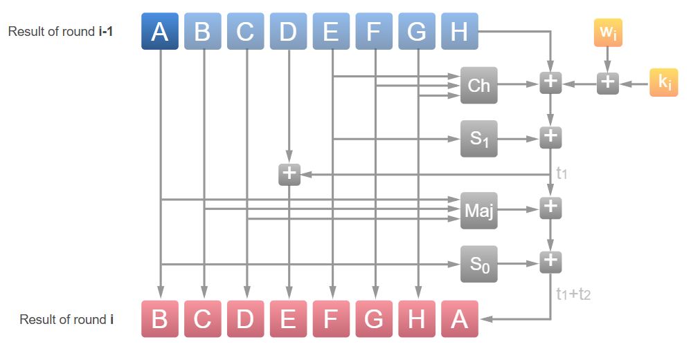
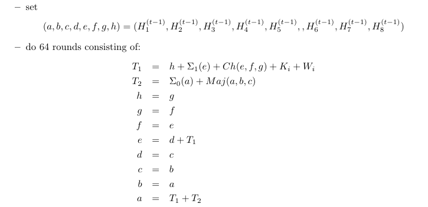
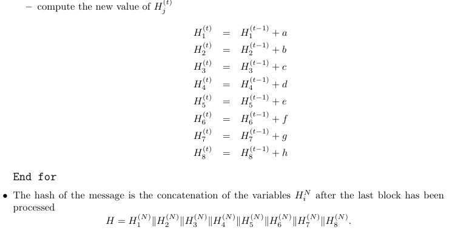
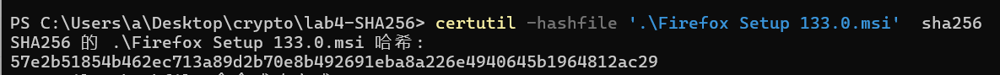
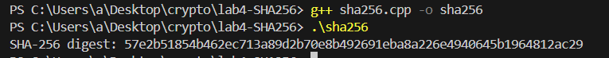

# **现代密码学实验报告**


| 实验名称：SHA-256的实现 | 实验时间：2024-12-10 |
| :---------------------- | -------------------- |
| 学生姓名：庄云皓        | 学号：22336327       |
| 学生班级：22级保密管理  | 成绩评定：           |

## **实验 4-1：SHA-256 的实现**

### **实验目的**

SHA-256 是目前使用最广泛的密码学安全 Hash 函数, 通过在实验中实现 SHA-256，加深对SHA-256的理解，掌握哈希函数的基本原理和特性。

### **实验内容**

用C/C++ 实现SHA-256

采用自己的方法和采用SHA-NI指令集分别实现，性能如下：


参数要求：

**输入**:输入数据就是需要计算 SHA-256 的数据，以二进制从stdin输入

**输出** :以二进制格式输出它的 SHA-256。

如样例数据 "ABC"

```
61 62 63
```

SHA-256的值为

```
BA 78 16 BF 8F 01 CF EA 41 41 40 DE 5D AE 22 23
B0 03 61 A3 96 17 7A 9C B4 10 FF 61 F2 00 15 AD
```

### **实验原理**

参见[SHA-256.pdf](https://helix.stormhub.org/papers/SHA-256.pdf)

SHA 256通过将消息和文件等数据转换为固定长度为256位的、且难以区分的字符串来保护数据不被截取或篡改。


1. **Message**:
   - 这是待处理的原始消息。
2. **Blocks**:
   - 消息被分成一个个固定大小的块（Block），通常是512比特。图中显示了四个块：Block 0, Block 1, Block 2 和 Block 3。
3. **Padding**:
   - 如果消息的字节长度不是512比特的整数倍，需要对最后一块进行填充（padding）。填充过程会在消息后面加入特定的格式以满足位数要求。
4. **Hash Function f**:
   - 对每一个块应用哈希函数f进行处理。这个函数涉及多个复杂的操作，如位运算和非线性函数，逐步改变内部状态。
5. **State Variables S0,S1,S2,S3**:
   - 这些是中间状态的变量，用于保存和处理过程中的临时结果。随着块的逐一处理，状态不断更新。
6. **Result**:
   - 最终经过所有块处理后得到的结果，即256位的哈希值。

也就是说，每一次将上一个分组压缩后的state和此时的分组block作为输入进行压缩。`S0`

初始哈希值H(1-8)取自自然数中前面8个质数(2,3,5,7,11,13,17,19)的平方根的小数部分, 并且取前面的32位. 下面举个例子: 小数部分约为0.414213562373095048, 而其中


于是, 质数2的平方根的小数部分取前32位就对应0x6a09e667。以此类推可得8个初始哈希值。

```cpp
// 初始哈希值
const uint32_t H0[8] = {
    0x6a09e667, 0xbb67ae85, 0x3c6ef372, 0xa54ff53a,
    0x510e527f, 0x9b05688c, 0x1f83d9ab, 0x5be0cd19
};
```

与8个初始哈希值获取的方式类似，64个哈希常量取自自然数中前面64个质数(2,3,5,7,11,13,17,19,23,29,31,37,41,43,47,53,59,61,67,71,73,79,83,89,97…)的立方根的小数部分, 并且取前面的32位。

```cpp
static const uint32_t K[64] = {
    0x428a2f98, 0x71374491, 0xb5c0fbcf, 0xe9b5dba5,
    0x3956c25b, 0x59f111f1, 0x923f82a4, 0xab1c5ed5,
    0xd807aa98, 0x12835b01, 0x243185be, 0x550c7dc3,
    0x72be5d74, 0x80deb1fe, 0x9bdc06a7, 0xc19bf174,
    0xe49b69c1, 0xefbe4786, 0x0fc19dc6, 0x240ca1cc,
    0x2de92c6f, 0x4a7484aa, 0x5cb0a9dc, 0x76f988da,
    0x983e5152, 0xa831c66d, 0xb00327c8, 0xbf597fc7,
    0xc6e00bf3, 0xd5a79147, 0x06ca6351, 0x14292967,
    0x27b70a85, 0x2e1b2138, 0x4d2c6dfc, 0x53380d13,
    0x650a7354, 0x766a0abb, 0x81c2c92e, 0x92722c85,
    0xa2bfe8a1, 0xa81a664b, 0xc24b8b70, 0xc76c51a3,
    0xd192e819, 0xd6990624, 0xf40e3585, 0x106aa070,
    0x19a4c116, 0x1e376c08, 0x2748774c, 0x34b0bcb5,
    0x391c0cb3, 0x4ed8aa4a, 0x5b9cca4f, 0x682e6ff3,
    0x748f82ee, 0x78a5636f, 0x84c87814, 0x8cc70208,
    0x90befffa, 0xa4506ceb, 0xbef9a3f7, 0xc67178f2
};

```

每个compress的实现如下



### **实验步骤（源代码）**

规范的编程语言代码。

+ **预处理部分**：padding

```cpp
void sha256_padding(int file_size, uint8_t *buffer, size_t *buffer_len) {
    // 计算文件的总长度（以字节为单位）   
  
    // 计算填充后的总长度
    size_t total_bits = file_size * 8;
    size_t padding_bits = 448 - (total_bits % 512);
    if (padding_bits <= 0) {
        padding_bits += 512;
    }
    size_t padding_bytes = padding_bits / 8;

    // 
    size_t bytes_read = file_size%BLOCK_SIZE;
  
    // fread(buffer, 1, bytes_read, file);
    // 在末尾添加一个1
    buffer[bytes_read] = 0x80;
    bytes_read++;

    // 填充0直到达到512位的倍数
    for (size_t i = bytes_read; i < BLOCK_SIZE - 8; i++) {
        buffer[i] = 0x00;
    }

    // 添加原始消息的长度（64位）
    uint64_t original_length = total_bits;
    for (int i = 0; i < 8; i++) {
        buffer[BLOCK_SIZE -8 + i] = (original_length >> (56 - i * 8)) & 0xFF;
    }

    *buffer_len = file_size + padding_bytes;
}

```

每个分组的压缩函数`sha256_compress`





```cpp
// SHA-256压缩函数
void sha256_compress(uint32_t *state, const uint8_t *block) {
    uint32_t W[64];
    uint32_t a, b, c, d, e, f, g, h, t1, t2;

    // 消息调度
    for (int t = 0; t < 16; t++) {
        W[t] = (block[t * 4] << 24) | (block[t * 4 + 1] << 16) | (block[t * 4 + 2] << 8) | block[t * 4 + 3];
    }
    for (int t = 16; t < 64; t++) {
        W[t] = W[t - 16] + (rotr(W[t - 15], 7) ^ rotr(W[t - 15], 18) ^ (W[t - 15] >> 3)) + W[t - 7] + (rotr(W[t - 2], 17) ^ rotr(W[t - 2], 19) ^ (W[t - 2] >> 10));
    }

    // 初始化工作变量
    a = state[0];
    b = state[1];
    c = state[2];
    d = state[3];
    e = state[4];
    f = state[5];
    g = state[6];
    h = state[7];

    // 主循环
    for (int t = 0; t < 64; t++) {
        t1 = h + (rotr(e, 6) ^ rotr(e, 11) ^ rotr(e, 25)) + ((e & f) ^ ((~e) & g)) + K[t] + W[t];
        t2 = (rotr(a, 2) ^ rotr(a, 13) ^ rotr(a, 22)) + ((a & b) ^ (a & c) ^ (b & c));
        h = g;
        g = f;
        f = e;
        e = d + t1;
        d = c;
        c = b;
        b = a;
        a = t1 + t2;
    }

    // 更新状态
    state[0] += a;
    state[1] += b;
    state[2] += c;
    state[3] += d;
    state[4] += e;
    state[5] += f;
    state[6] += g;
    state[7] += h;
}
```

main函数中主要部分

```cpp
    uint8_t buffer[BLOCK_SIZE];  // 缓冲区大小为64字节
    size_t buffer_len;
    size_t file_size;
    size_t bytes_read;

    // 计算文件大小
    fseek(file, 0, SEEK_END);
    file_size = ftell(file);
    fseek(file, 0, SEEK_SET);

    uint32_t state[8];
    memcpy(state, H0, sizeof(H0));
    int r = file_size % BLOCK_SIZE;
    if(r >= r){
    for(int i = 0;i<1+file_size/BLOCK_SIZE;i++){
        fread(buffer, 1, BLOCK_SIZE, file);

        if(i == file_size/BLOCK_SIZE){
            buffer[r] = 0x80;
            for(int j = r+1;j<64;j++){
                buffer[j] = 0x00;
            }
        }
        sha256_compress(state,buffer);
    }
    } else{
        for(int i = 0;i<file_size/BLOCK_SIZE;i++){
        fread(buffer, 1, BLOCK_SIZE, file);

        sha256_compress(state,buffer);

    }
    }
    memset(buffer, 0, BLOCK_SIZE);

    fread(buffer, 1, file_size%BLOCK_SIZE, file);
    sha256_padding(file_size, buffer, &buffer_len);

    sha256_compress(state,buffer);
  
    // 关闭文件
    fclose(file);

    uint8_t digest[32];
    // sha256(buffer, buffer_len, digest);
    for (int i = 0; i < 8; i++) {
        digest[i * 4] = (state[i] >> 24) & 0xFF;
        digest[i * 4 + 1] = (state[i] >> 16) & 0xFF;
        digest[i * 4 + 2] = (state[i] >> 8) & 0xFF;
        digest[i * 4 + 3] = state[i] & 0xFF;
    }

    // 输出摘要
    printf("SHA-256 digest: ");
    for (int i = 0; i < 32; i++) {
        printf("%02x", digest[i]);
    }
```

结果检查与测试:在测试平台上能AC。

**以上代码的小问题**（来自助教）：

如果inputFile是stdin的话，对它使用fseek和ftell以及“文件大小”这个概念是没有意义的，因此SHA-256计算过程中的数据长度不能靠“文件大小”直接填上，

如果运行方式类似于submission < dump.bin，这种情况下系统做的相当于fopen(dump.bin)然后用得到的fd对stdin进行freopen，所以仍然还能获取到文件大小。

但是如果用cat dump.bin | submission运行代码的话，由于stdin不是文件，你用ftell得到的file_size就会变成-1，然后程序会卡死。

**解决方案：**

实现了update和final函数，数据长度而应该根据每次update的数据长度累加得到。update每满64个byte进行一次j计算

```cpp
void sha256_update(BYTE data[], uint32_t state[],  uint8_t buffer[],size_t len)
{
	int i;

	for (i = 0; i < len; ++i) {
		buffer[datalen] = data[i];
		datalen++;
		if (datalen == 64) {
			sha256_compress(state, buffer);
			bitlen += 512;
			datalen = 0;
		}
	}
}
```

final函数:分当前buffer中的新读入的data是否小于56个byte,分情况进行padding. 直接补上0x80，小于56,最后补上长度；大于56时会要多计算一个block（0000……最后8个byte为数据总长度）。

最后计算得到最终的hash值。

```cpp
void sha256_final(BYTE data[], uint32_t state[], BYTE digest[])
{
	int i;

	i = datalen;
  

	if (datalen < 56) {
		data[i++] = 0x80;
		while (i < 56)
			data[i++] = 0x00;
	}
	else {
		data[i++] = 0x80;
		while (i < 64)
			data[i++] = 0x00;

		sha256_compress(state, data);
		memset(data, 0, 56);
	}

	bitlen += datalen * 8;
    // printf("bitlen = %d\n",bitlen);

    for (int i = 0; i < 8; i++) {
        data[BLOCK_SIZE -8 + i] = (bitlen >> (56 - i * 8)) & 0xFF;
    }

    sha256_compress(state, data);


	for (i = 0; i < 4; ++i) {
		digest[i]      = (state[0] >> (24 - i * 8)) & 0x000000ff;
		digest[i + 4]  = (state[1] >> (24 - i * 8)) & 0x000000ff;
		digest[i + 8]  = (state[2] >> (24 - i * 8)) & 0x000000ff;
		digest[i + 12] = (state[3] >> (24 - i * 8)) & 0x000000ff;
		digest[i + 16] = (state[4] >> (24 - i * 8)) & 0x000000ff;
		digest[i + 20] = (state[5] >> (24 - i * 8)) & 0x000000ff;
		digest[i + 24] = (state[6] >> (24 - i * 8)) & 0x000000ff;
		digest[i + 28] = (state[7] >> (24 - i * 8)) & 0x000000ff;
	}
}
```

现在main函数代码也很简洁了：

```cpp
    int bytesRead = 0;

    while ((bytesRead = fread(data, 1,1000000 , file)) > 0) 
    {
        sha256_update(data,state, buffer, bytesRead);
    }
  
    sha256_final(buffer, state, digest);
```

算一下火狐浏览器setup文件的哈希值





结果正确，但是计算时间比系统自带的长了不少。

**采用SHA-NI指令集加速计算**

参考了[https://github.com/wangkui0508/sha256/blob/main](https://github.com/wangkui0508/sha256/blob/main)

对之前代码中的`sha-compress`函数采用SHA-NI指令集实现

使用到的指令集：

- `_mm_loadu_si128`: 从内存中加载未对齐的128位数据到寄存器。
- `_mm_storeu_si128`: 将128位数据存储到内存中。
- `_mm_shuffle_epi32`: 根据指定的掩码重新排列寄存器中的32位整数组。
- `_mm_alignr_epi8`: 将一个寄存器的字节右对齐，与另一个寄存器合并。
- `_mm_blend_epi16`: 根据掩码在两个寄存器之间混合数据。
- `_mm_shuffle_epi8`: 根据掩码重排8位字节。
- `_mm_add_epi32`: 将两个寄存器中的32位整数相加。
- `_mm_sha256rnds2_epu32`: 执行SHA-256的轮次计算，处理状态和消息。
- `_mm_sha256msg1_epu32` 和 `_mm_sha256msg2_epu32`: 用于计算SHA-256中的消息调度（即生成新的消息）。

**处理过程：**

**初始化**:

- `state`数组包含当前的哈希状态，共8个32位整型（256位）。
- `data`是输入的消息块，长度为64字节。

**状态加载**:

- 将`state`中的哈希状态加载到SIMD寄存器`STATE0`和`STATE1`中，并进行重排以便后续处理。

**主循环处理**:

- 代码中有64轮SHA-256的处理，但每轮处理的过程几乎是相似的，主要分为多个轮次（每轮使用不同的常量和消息）。
- 在每个轮次中，消息被加载并经过打乱、加常量和状态更新的处理。
- 通过SIMD指令并行处理多个数据，加速哈希计算。

**状态更新**:

- 最后将更新后的状态与初始状态相加，生成新的哈希状态，并存储回`state`中。

```cpp
void sha256_compress(uint32_t state[8], const uint8_t data[])
{
    __m128i STATE0, STATE1;
    __m128i MSG, TMP;
    __m128i MSG0, MSG1, MSG2, MSG3;
    __m128i ABEF_SAVE, CDGH_SAVE;
    const __m128i MASK = _mm_set_epi64x(0x0c0d0e0f08090a0bULL, 0x0405060700010203ULL);

    //将当前哈希状态加载到 SIMD 寄存器中。
    TMP = _mm_loadu_si128((const __m128i*) &state[0]);
    STATE1 = _mm_loadu_si128((const __m128i*) &state[4]);
    //重排状态
    TMP = _mm_shuffle_epi32(TMP, 0xB1);          /* CDAB */
    STATE1 = _mm_shuffle_epi32(STATE1, 0x1B);    /* EFGH */
    STATE0 = _mm_alignr_epi8(TMP, STATE1, 8);    /* ABEF */
    STATE1 = _mm_blend_epi16(STATE1, TMP, 0xF0); /* CDGH */


        /* 保存当前状态 */
        ABEF_SAVE = STATE0;
        CDGH_SAVE = STATE1;

        /* 轮次 0-3 */
        MSG = _mm_loadu_si128((const __m128i*) (data+0)); // 加载消息
        MSG0 = _mm_shuffle_epi8(MSG, MASK); // 打乱消息
        MSG = _mm_add_epi32(MSG0, _mm_set_epi64x(0xE9B5DBA5B5C0FBCFULL, 0x71374491428A2F98ULL)); // 添加常量
        STATE1 = _mm_sha256rnds2_epu32(STATE1, STATE0, MSG); // 更新状态1
        MSG = _mm_shuffle_epi32(MSG, 0x0E); // 再次打乱消息
        STATE0 = _mm_sha256rnds2_epu32(STATE0, STATE1, MSG); // 更新状态0

        /* 轮次 4-7 */
        MSG1 = _mm_loadu_si128((const __m128i*) (data+16)); // 加载下一个消息块
        MSG1 = _mm_shuffle_epi8(MSG1, MASK); // 打乱消息
        MSG = _mm_add_epi32(MSG1, _mm_set_epi64x(0xAB1C5ED5923F82A4ULL, 0x59F111F13956C25BULL)); // 添加常量
        STATE1 = _mm_sha256rnds2_epu32(STATE1, STATE0, MSG); // 更新状态1
        MSG = _mm_shuffle_epi32(MSG, 0x0E); // 再次打乱消息
        STATE0 = _mm_sha256rnds2_epu32(STATE0, STATE1, MSG); // 更新状态0
        MSG0 = _mm_sha256msg1_epu32(MSG0, MSG1); // 计算消息1

        /* 轮次 8-11 */
        MSG2 = _mm_loadu_si128((const __m128i*) (data+32)); // 加载消息
        MSG2 = _mm_shuffle_epi8(MSG2, MASK); // 打乱消息
        MSG = _mm_add_epi32(MSG2, _mm_set_epi64x(0x550C7DC3243185BEULL, 0x12835B01D807AA98ULL)); // 添加常量
        STATE1 = _mm_sha256rnds2_epu32(STATE1, STATE0, MSG); // 更新状态1
        MSG = _mm_shuffle_epi32(MSG, 0x0E); // 再次打乱消息
        STATE0 = _mm_sha256rnds2_epu32(STATE0, STATE1, MSG); // 更新状态0
        MSG1 = _mm_sha256msg1_epu32(MSG1, MSG2); // 计算消息2

        /* Rounds 12-15 */
        MSG3 = _mm_loadu_si128((const __m128i*) (data+48));
        MSG3 = _mm_shuffle_epi8(MSG3, MASK);
        MSG = _mm_add_epi32(MSG3, _mm_set_epi64x(0xC19BF1749BDC06A7ULL, 0x80DEB1FE72BE5D74ULL));
        STATE1 = _mm_sha256rnds2_epu32(STATE1, STATE0, MSG);
        TMP = _mm_alignr_epi8(MSG3, MSG2, 4);
        MSG0 = _mm_add_epi32(MSG0, TMP);
        MSG0 = _mm_sha256msg2_epu32(MSG0, MSG3);
        MSG = _mm_shuffle_epi32(MSG, 0x0E);
        STATE0 = _mm_sha256rnds2_epu32(STATE0, STATE1, MSG);
        MSG2 = _mm_sha256msg1_epu32(MSG2, MSG3);

        /* Rounds 16-19 */
        MSG = _mm_add_epi32(MSG0, _mm_set_epi64x(0x240CA1CC0FC19DC6ULL, 0xEFBE4786E49B69C1ULL));
        STATE1 = _mm_sha256rnds2_epu32(STATE1, STATE0, MSG);
        TMP = _mm_alignr_epi8(MSG0, MSG3, 4);
        MSG1 = _mm_add_epi32(MSG1, TMP);
        MSG1 = _mm_sha256msg2_epu32(MSG1, MSG0);
        MSG = _mm_shuffle_epi32(MSG, 0x0E);
        STATE0 = _mm_sha256rnds2_epu32(STATE0, STATE1, MSG);
        MSG3 = _mm_sha256msg1_epu32(MSG3, MSG0);

        /* Rounds 20-23 */
        MSG = _mm_add_epi32(MSG1, _mm_set_epi64x(0x76F988DA5CB0A9DCULL, 0x4A7484AA2DE92C6FULL));
        STATE1 = _mm_sha256rnds2_epu32(STATE1, STATE0, MSG);
        TMP = _mm_alignr_epi8(MSG1, MSG0, 4);
        MSG2 = _mm_add_epi32(MSG2, TMP);
        MSG2 = _mm_sha256msg2_epu32(MSG2, MSG1);
        MSG = _mm_shuffle_epi32(MSG, 0x0E);
        STATE0 = _mm_sha256rnds2_epu32(STATE0, STATE1, MSG);
        MSG0 = _mm_sha256msg1_epu32(MSG0, MSG1);

        /* Rounds 24-27 */
        MSG = _mm_add_epi32(MSG2, _mm_set_epi64x(0xBF597FC7B00327C8ULL, 0xA831C66D983E5152ULL));
        STATE1 = _mm_sha256rnds2_epu32(STATE1, STATE0, MSG);
        TMP = _mm_alignr_epi8(MSG2, MSG1, 4);
        MSG3 = _mm_add_epi32(MSG3, TMP);
        MSG3 = _mm_sha256msg2_epu32(MSG3, MSG2);
        MSG = _mm_shuffle_epi32(MSG, 0x0E);
        STATE0 = _mm_sha256rnds2_epu32(STATE0, STATE1, MSG);
        MSG1 = _mm_sha256msg1_epu32(MSG1, MSG2);

        /* Rounds 28-31 */
        MSG = _mm_add_epi32(MSG3, _mm_set_epi64x(0x1429296706CA6351ULL,  0xD5A79147C6E00BF3ULL));
        STATE1 = _mm_sha256rnds2_epu32(STATE1, STATE0, MSG);
        TMP = _mm_alignr_epi8(MSG3, MSG2, 4);
        MSG0 = _mm_add_epi32(MSG0, TMP);
        MSG0 = _mm_sha256msg2_epu32(MSG0, MSG3);
        MSG = _mm_shuffle_epi32(MSG, 0x0E);
        STATE0 = _mm_sha256rnds2_epu32(STATE0, STATE1, MSG);
        MSG2 = _mm_sha256msg1_epu32(MSG2, MSG3);

        /* Rounds 32-35 */
        MSG = _mm_add_epi32(MSG0, _mm_set_epi64x(0x53380D134D2C6DFCULL, 0x2E1B213827B70A85ULL));
        STATE1 = _mm_sha256rnds2_epu32(STATE1, STATE0, MSG);
        TMP = _mm_alignr_epi8(MSG0, MSG3, 4);
        MSG1 = _mm_add_epi32(MSG1, TMP);
        MSG1 = _mm_sha256msg2_epu32(MSG1, MSG0);
        MSG = _mm_shuffle_epi32(MSG, 0x0E);
        STATE0 = _mm_sha256rnds2_epu32(STATE0, STATE1, MSG);
        MSG3 = _mm_sha256msg1_epu32(MSG3, MSG0);

        /* Rounds 36-39 */
        MSG = _mm_add_epi32(MSG1, _mm_set_epi64x(0x92722C8581C2C92EULL, 0x766A0ABB650A7354ULL));
        STATE1 = _mm_sha256rnds2_epu32(STATE1, STATE0, MSG);
        TMP = _mm_alignr_epi8(MSG1, MSG0, 4);
        MSG2 = _mm_add_epi32(MSG2, TMP);
        MSG2 = _mm_sha256msg2_epu32(MSG2, MSG1);
        MSG = _mm_shuffle_epi32(MSG, 0x0E);
        STATE0 = _mm_sha256rnds2_epu32(STATE0, STATE1, MSG);
        MSG0 = _mm_sha256msg1_epu32(MSG0, MSG1);

        /* Rounds 40-43 */
        MSG = _mm_add_epi32(MSG2, _mm_set_epi64x(0xC76C51A3C24B8B70ULL, 0xA81A664BA2BFE8A1ULL));
        STATE1 = _mm_sha256rnds2_epu32(STATE1, STATE0, MSG);
        TMP = _mm_alignr_epi8(MSG2, MSG1, 4);
        MSG3 = _mm_add_epi32(MSG3, TMP);
        MSG3 = _mm_sha256msg2_epu32(MSG3, MSG2);
        MSG = _mm_shuffle_epi32(MSG, 0x0E);
        STATE0 = _mm_sha256rnds2_epu32(STATE0, STATE1, MSG);
        MSG1 = _mm_sha256msg1_epu32(MSG1, MSG2);

        /* Rounds 44-47 */
        MSG = _mm_add_epi32(MSG3, _mm_set_epi64x(0x106AA070F40E3585ULL, 0xD6990624D192E819ULL));
        STATE1 = _mm_sha256rnds2_epu32(STATE1, STATE0, MSG);
        TMP = _mm_alignr_epi8(MSG3, MSG2, 4);
        MSG0 = _mm_add_epi32(MSG0, TMP);
        MSG0 = _mm_sha256msg2_epu32(MSG0, MSG3);
        MSG = _mm_shuffle_epi32(MSG, 0x0E);
        STATE0 = _mm_sha256rnds2_epu32(STATE0, STATE1, MSG);
        MSG2 = _mm_sha256msg1_epu32(MSG2, MSG3);

        /* Rounds 48-51 */
        MSG = _mm_add_epi32(MSG0, _mm_set_epi64x(0x34B0BCB52748774CULL, 0x1E376C0819A4C116ULL));
        STATE1 = _mm_sha256rnds2_epu32(STATE1, STATE0, MSG);
        TMP = _mm_alignr_epi8(MSG0, MSG3, 4);
        MSG1 = _mm_add_epi32(MSG1, TMP);
        MSG1 = _mm_sha256msg2_epu32(MSG1, MSG0);
        MSG = _mm_shuffle_epi32(MSG, 0x0E);
        STATE0 = _mm_sha256rnds2_epu32(STATE0, STATE1, MSG);
        MSG3 = _mm_sha256msg1_epu32(MSG3, MSG0);

        /* Rounds 52-55 */
        MSG = _mm_add_epi32(MSG1, _mm_set_epi64x(0x682E6FF35B9CCA4FULL, 0x4ED8AA4A391C0CB3ULL));
        STATE1 = _mm_sha256rnds2_epu32(STATE1, STATE0, MSG);
        TMP = _mm_alignr_epi8(MSG1, MSG0, 4);
        MSG2 = _mm_add_epi32(MSG2, TMP);
        MSG2 = _mm_sha256msg2_epu32(MSG2, MSG1);
        MSG = _mm_shuffle_epi32(MSG, 0x0E);
        STATE0 = _mm_sha256rnds2_epu32(STATE0, STATE1, MSG);

        /* Rounds 56-59 */
        MSG = _mm_add_epi32(MSG2, _mm_set_epi64x(0x8CC7020884C87814ULL, 0x78A5636F748F82EEULL));
        STATE1 = _mm_sha256rnds2_epu32(STATE1, STATE0, MSG);
        TMP = _mm_alignr_epi8(MSG2, MSG1, 4);
        MSG3 = _mm_add_epi32(MSG3, TMP);
        MSG3 = _mm_sha256msg2_epu32(MSG3, MSG2);
        MSG = _mm_shuffle_epi32(MSG, 0x0E);
        STATE0 = _mm_sha256rnds2_epu32(STATE0, STATE1, MSG);

        /* Rounds 60-63 */
        MSG = _mm_add_epi32(MSG3, _mm_set_epi64x(0xC67178F2BEF9A3F7ULL, 0xA4506CEB90BEFFFAULL));
        STATE1 = _mm_sha256rnds2_epu32(STATE1, STATE0, MSG);
        MSG = _mm_shuffle_epi32(MSG, 0x0E);
        STATE0 = _mm_sha256rnds2_epu32(STATE0, STATE1, MSG);

        /* Combine state  */
        STATE0 = _mm_add_epi32(STATE0, ABEF_SAVE);
        STATE1 = _mm_add_epi32(STATE1, CDGH_SAVE);


    TMP = _mm_shuffle_epi32(STATE0, 0x1B);       /* FEBA */
    STATE1 = _mm_shuffle_epi32(STATE1, 0xB1);    /* DCHG */
    STATE0 = _mm_blend_epi16(TMP, STATE1, 0xF0); /* DCBA */
    STATE1 = _mm_alignr_epi8(STATE1, TMP, 8);    /* ABEF */

    /* Save state */
    _mm_storeu_si128((__m128i*) &state[0], STATE0);
    _mm_storeu_si128((__m128i*) &state[4], STATE1);
}
```

提交序号为2432

### **思考题**

SHA-1 的初始常数是很有规律的 `0x67452301, 0xEFCDAB89, 0x98BADCFE, 0x10325476, 0xC3D2E1F0`，SHA-256 的初始常数和轮常数分别来自于前几个素数的平方根/立方根的小数部分。为什么要这么设计？

**这些被称为 Nothing Up My Sleeve 数字。[“我的袖子里没有东西”数 - 维基百科，自由的百科全书](https://zh.wikipedia.org/wiki/“我的袖子里没有东西”数)。这些算法通常需要随机常数常来进行混合或初始化。密码学家希望以一种方式选择这些值，以证明这些常数的选择不是出于恶意目的的，例如为算法创建一个后门。**

SHA-1 的初始常数是很有规律的，

如果以 little-endian 表示，则可以看出它是一个简单的 4 位计数器，从 0000 开始，最大到 1111，然后反向后退，以 32 位为一组：

```
0111 0110 0101 0100 0011 0010 0001 0000 = LE 0x76543210 = BE 0x67452301 `
1111 1110 1101 1100 1011 1010 1001 1000 = LE 0xFEDCBA98 = BE 0xEFCDAB89 `
1000 1001 1010 1011 1100 1101 1110 1111 = LE 0x89ABCDEF = BE 0x98BADCFE `
0000 0001 0010 0011 0100 0101 0110 0111 = LE 0x01234567 = BE 0x10325476 
```

最终的 big-endian 值是从 1100 开始的递增计数器，对于偶数组，是从 0011 开始的递减计数器。这些数中01的概率均等。

无理数（例如π、e和无理根）在其中的各个位上的数字被认为以相等的频率出现（参见[正规数](https://zh.wikipedia.org/wiki/正规数)）。信息熵较高。

素数的平方根和立方根的小数部分具有高度的分布均匀性，符合伪随机数的特性。这种均匀性对于散列函数的安全性至关重要，因为它有助于避免偏差，确保每一位输出都接近均匀分布。所以SHA-256 的初始常数和轮常数分别来自于前几个素数的平方根/立方根的小数部分。

有一类 hash 算法被称为“Non-cryptographic hash function”，例如 [Java (OpenJDK) 中 `hashCode` 的实现](https://github.com/openjdk/jdk/blob/ac2fede165e0ecbfa51f5cc75a3218c51e3528be/src/java.base/share/classes/jdk/internal/util/ArraysSupport.java#L362)是非常简单的迭代计算 `h = 31 * h + x`，其他的此类算法包括 [FNV](http://www.isthe.com/chongo/tech/comp/fnv/index.html)、[MurmurHash](https://github.com/aappleby/smhasher)、[xxHash](https://github.com/Cyan4973/xxHash) 等。它们与 MD5、SHA-1、SHA-256 等 hash 算法的区别是什么？它们有哪些主要用途？为什么会比 SHA-256 等等更适合用于这些场景？

**Cryptographic Hash Functions**：

- 主要用于密码学和安全领域，设计时强调**抗碰撞性**、**抗篡改性**和**单向性**。
- 需要满足严格的安全性属性，包括：

  - **抗碰撞性（Collision Resistance）**：难以找到两个不同的输入，它们的哈希值相同。
  - **抗第二原像攻击（Second Pre-image Resistance）（第二原像稳固）**：难以找到与某个输入具有相同哈希值的另一个输入。
  - **不可逆性（Pre-image Resistance）（原像稳固）**：从输出推测输入是不可能的。
- 通常用于数字签名、数据完整性校验、消息认证等安全相关应用。

**Non-cryptographic Hash Functions**：

- 设计目标是**速度快**和**输出分布均匀**，而不是安全性。
- 不需要满足密码学上的安全性属性，因此可以用更简单的算法实现。
- 主要用于非安全领域，例如哈希表、数据去重、负载均衡等场景。

非加密哈希函数的计算开销非常小，比 SHA-256 等加密哈希函数快几个数量级，非常适合需要频繁计算哈希值的场景。

比如在哈希表中，每次插入、查询或删除元素都需要计算一次哈希值，性能是关键。

如果你需要设计一个用户系统，你也许知道数据库中不应该以明文存储用户的密码（遗憾的是，我国的知名计算机技术社区 CSDN 就犯过[这样的错误](https://news.sina.com.cn/o/2011-12-22/044523673588.shtml)），而应该存储密码的 hash。但是，在这种情况下直接使用 SHA-256 等等仍然是不推荐的。有哪些 hash 算法更适合用来处理密码？它们与 SHA-256 等等有什么区别？

为什么SHA-256在这种情况仍然不够安全？

**穷举法攻击**

密码明文的位数有限

大部分人的密码都非常简单，当拿到hash的密码后，攻击者也可以通过比对的方式，比如4位数

那么攻击者可以把0到9999个数字都hash一下，然后和你密码的hash值对比一下，就知道你原密码是什么了。

**彩虹表攻击**

除了穷举法外，由于之前的密码泄露，那么攻击者们，手上都有大量的彩虹表，比如"I love you",生日等等，这个表保存了这些原值以及hash后的值，那么使用时直接从已有库里就可以查出来对应的密码。

**SHA-256 的内存使用较低，攻击者可以使用大量并行计算资源进行破解。**

所以我们要加盐和提高攻击者的计算成本。

一些更适合密码hash的hash算法

1. **bcrypt**
   - **特点**：bcrypt 是基于 Blowfish 加密算法的密码 hash 函数，除了加盐来抵御rainbow table 攻击之外,它具有自适应调整计算复杂度的能力，可以通过增加迭代次数来提高计算成本。
   - **优点**：防止彩虹表攻击，并能抵御暴力破解，因为增加计算复杂度会显著增加破解所需时间。
2. **scrypt**
   - **特点**：scrypt 设计用于大规模并行计算，增加了内存消耗来提高计算成本。
   - **优点**：由于需要大量内存，scrypt 对于使用专用硬件（如 ASIC）进行暴力破解的攻击者来说，成本显著提高。
3. **Argon2**
   - **特点**：Argon2 是 2015 年密码哈希竞赛的冠军，支持多种调节参数（如时间复杂度、空间复杂度和并行度）。
   - **优点**：提供了极高的安全性和灵活性，能够有效抵御各种攻击。

scrypt 和 Argon2 通过增加内存需求来限制并行处理，提高了安全性。

### **实验总结**

通过本次实验，我深入了解了SHA-256哈希函数的实现原理，掌握了哈希函数的基本原理和特性, 并通过SHA指令集进行加速。实验的思考题比较有意思，我了解了不同类型的哈希函数及其适用场景，这对于我们在实际应用中选择合适的哈希函数具有重要意义。
