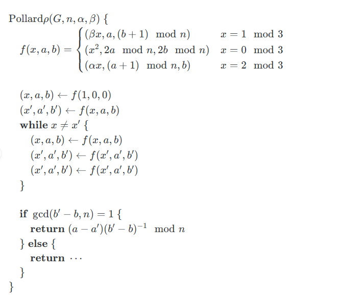
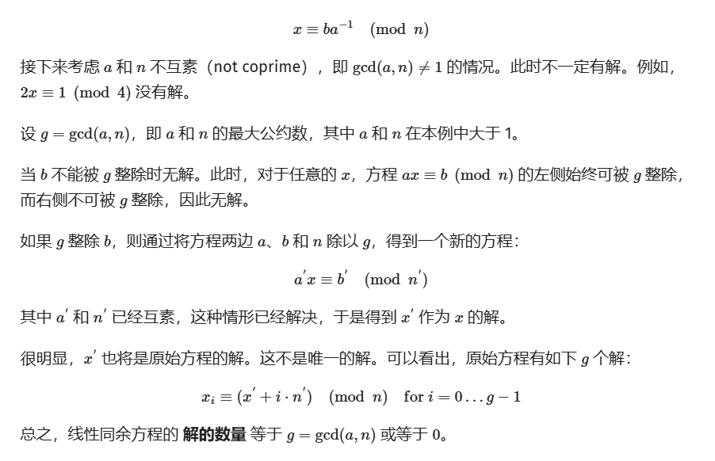
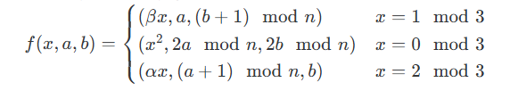
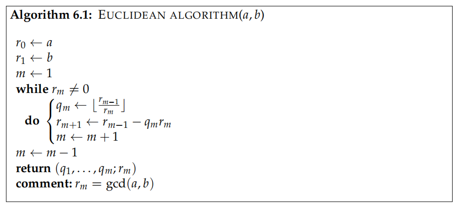
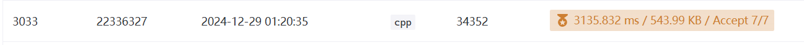
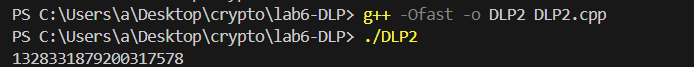
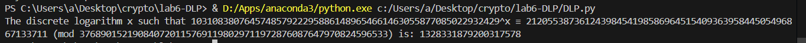

# **现代密码学实验报告**

| 实验名称：DLP 计算     | 实验时间：2024-12-30 |
| :--------------------- | -------------------- |
| 学生姓名：庄云皓       | 学号：22336327       |
| 学生班级：22级保密管理 | 成绩评定：           |

## **实验 6-1：DLP 计算**

### **实验目的**

通过实现DLP离散对数计算，体会离散对数计算的困难性，进而加深对elgamal等基于离散对数密码方案的认识.

### **实验内容**

用C++实现DLP计算算法Pollard ρ

**输入**:

- $p$ ：群G的阶
- $n$ ：群元素α的阶
- $α$
- $β$

在群$G$中，已知 $α∈G$ 是一个 $n$阶元素，我们需要计算 $β∈⟨α⟩$ 的离散对数 $x=log⁡_αβ$,也就是

$$\alpha^x=\beta$$ ,求$x$

**输出：**$x$

十进制文本输入输出

### **实验原理**




后一步相当于在线性方程 $c(b′−b)=a−a′(mod  n)$ 中解出$ c$为离散对数的解

我们令

$a := a−a ′$

$b := b ′ − b$

如果$gcd(b ′ − b,n)==1$，可以由上面的公式求解

如果$gcd(b ′ − b,n) !=1$怎么办

可见关于线性同余方程的求解的说明：

[线性同余方程 - OI Wiki](https://oi-wiki.org/math/number-theory/linear-equation/)

（下面的a是b ′ − b，b是a−a ′）




用伪代码表示

```
g = gcd(b′−b,n)
a = a − a ′
b = b ′ − b

if(g!=1){
    a_ = a/g;
    b_ = b/g;
    n_ = n/g;
    x0 = a_*b^-1 mod n_;
    while(i>=1 and i<g)
        xi = x0+ i*n_ mod n;

}
```


### **实验步骤（源代码）**

规范的编程语言代码。

+ **$pollard\ \rho$ 算法**

它的主要思想是找碰撞，使用Floyd判环算法，f每次更新一次，f_每次更新两次，如果存在环的化他们最终会相遇

碰撞说明$g^{ai} * y^{bi} = g^{aj} * y^{bj}$

$log_gy = (ai-aj)*(bj-bi)^{-1}\  (mod n)$ 

(如果bj-bi有模n的逆元，也就是gcd(bj-bi,n)=1)

求解同余方程的过程上面说过了，不在赘述

```cpp
void BigInt::poll ardRho(uint32_t n[SIZE], uint32_t alpha[SIZE], uint32_t beta[SIZE])
{
    uint32_t f0[SIZE] = {1};  // 初始化f0
    uint32_t f1[SIZE] = {0};  // 初始化f1
    uint32_t f2[SIZE] = {0};  // 初始化f2

    // 更新f0, f1, f2的值
    update(f0, f1, f2, n, alpha, beta);
    uint32_t f0_[SIZE], f1_[SIZE], f2_[SIZE];

    // 复制f0, f1, f2到f0_, f1_, f2_
    for (int i = 0; i < SIZE; i++) {
        f0_[i] = f0[i];
        f1_[i] = f1[i];
        f2_[i] = f2[i];
    }
    
    // 再次更新f0_, f1_, f2_
    update(f0_, f1_, f2_, n, alpha, beta);

    // 循环直到f0与f0_相等
    while (memcmp(f0, f0_, SIZE) != 0) {
        update(f0, f1, f2, n, alpha, beta);
        update(f0_, f1_, f2_, n, alpha, beta);
        update(f0_, f1_, f2_, n, alpha, beta);
    }
    
    uint32_t g[SIZE];

    // 计算f2的差值
    if (isBigger(f2_, f2)) {
        subInternal(f2, f2_, f2);
    } else {
        subInternal(f2, f2, f2_);
        subInternal(f2, n, f2);
    }

    gcd(g, f2, n);  // 计算gcd

    // 计算f1的差值
    if (isBigger(f1, f1_)) {
        subInternal(f1, f1, f1_);
    } else {
        subInternal(f1, f1_, f1);
        subInternal(f1, n, f1);
    }

    if (isEqual(g, ONE)) {  // 特殊情况处理
        cout << "f2=" << biToStr(f2) << endl;
        cout << "f1=" << biToStr(f1) << endl;
        cout << "f0=" << biToStr(f0) << endl;

        invExculid(f2, f2, n);  // 计算f2的逆

        mulInternal(f1, f1, f2);  // 更新f1
        modn(f1, f1, n);  // 取模
        cout << "ans=" << biToStr(f1) << endl;
    } else {
        cout << "g=" << biToStr(g) << endl;

        // 分别对f1, f2和n进行除法
        divInternal(f1, f1, g);
        divInternal(f2, f2, g);
        uint32_t n_[SIZE];
        divInternal(n_, n, g);

        cout << "f1=" << biToStr(f1) << endl;
        cout << "f2=" << biToStr(f2) << endl;
        
        uint32_t inv[SIZE];
        invExculid(f2, f2, n_);  // 计算f2的逆
        mulInternal(f1, f1, f2);
        modn(f1, f1, n_);

        uint32_t beta1[SIZE] = {1};
        preCalculate();  // 预计算

        // 验证beta1与beta的相等性
        modPowMontgomery(beta1, alpha, f1);
        if (isEqual(beta1, beta)) {
            cout << biToStr(f1) << endl;
            return;  // 找到解
        }

        uint32_t cnt[SIZE] = {1};
        uint32_t ans[SIZE] = {1};

        // 循环尝试找到解
        while (isBigger(g, cnt)) {
            mulInternal(ans, n_, cnt);
            modn(ans, ans, n);
            addInternal(ans, ans, f1);
            modn(ans, ans, n);
            modPowMontgomery(beta1, alpha, ans);
            if (isEqual(beta1, beta)) {
                cout << biToStr(ans) << endl;
                return;  // 找到解
            }
            addInternal(cnt, cnt, ONE);  // 增加计数器
        }
    }
}
```

+ **update函数**（也就是f)



```cpp
void BigInt::update(uint32_t f0[SIZE], uint32_t f1[SIZE], uint32_t f2[SIZE],uint32_t n[SIZE], uint32_t alpha[SIZE], uint32_t beta[SIZE])
{

    // uint32_t temp[SIZE]={0};
    // modn(temp,f0,THREE);
    int temp = mod_int(f0,3);

    if(temp==1){
        // S1
        modMul(f0,f0,beta); //mod p
        addInternal(f2,f2,ONE);
        modn(f2,f2,n);  // mod n
    }else if(temp==0){
        modMul(f0,f0,f0);
        mulInternal(f1,f1,TWO);
        mulInternal(f2,f2,TWO);
        modn(f1,f1,n);
        modn(f2,f2,n);
    }else{
        modMul(f0,f0,alpha);
        addInternal(f1,f1,ONE);
        modn(f2,f2,n);
    }
}
```

+ **exgcd求解最大公因数**



```cpp
    void gcd(uint32_t r0[SIZE], uint32_t a[SIZE], uint32_t b[SIZE])
    {
        memcpy(r0, a, SIZE * sizeof(uint32_t));
        uint32_t r1[SIZE];
        memcpy(r1, b, SIZE * sizeof(uint32_t));
        
        uint32_t r2[SIZE]={0};
        uint32_t q[SIZE]={0};
        
        while(!isEqual(r1,ZERO)){
            divInternal(q,r0,r1);
            mulInternal(r2,r1,q);
            subInternal(r2,r0,r2);
            memcpy(r0,r1,SIZE*sizeof(uint32_t));
            memcpy(r1,r2,SIZE*sizeof(uint32_t));
        }


    }
```

有一些可以加速的地方：

1.`BigInt`只需要开$SIZE = 2*lb(p)$大小的数组,因为p最多才192bit，这里`uint32_t[SIZE]`的SIZE取12就可以了，这样可以省下很多循环；

2.因为n没有超过64bit,对于f函数里面的那些要$mod\ n$的数在运算中是不会超过128bit的，所有我们可以用一个`__uint128_t`的变量来保存那些值。

修改后的update函数

```cpp
void BigInt::update(uint32_t f0[SIZE], __uint128_t &f1, __uint128_t &f2,__uint128_t& n, uint32_t alpha[SIZE], uint32_t beta[SIZE]){
    int temp = mod_int(f0,3);

    if(temp==1){
        // S1
        modMul(f0,f0,beta);
        f2 = f2+1;
        f2 = f2 % n;
    }else if(temp==0){
    	//S2
        modMul(f0,f0,f0);
        f1 = f1*2%n;;
        f2 = f2*2%n;;
    }
    else{
        modMul(f0,f0,alpha);
        f1 = f1+1;
        f2 = f2 % n;
    }

}
```

3. mod 3 函数也可以单独实现，比减去除数*商来算余数更快一点

```cpp
int BigInt::mod_int(uint32_t a[SIZE],int n){
    __uint128_t d = 0;
    for(int i = SIZE - 1;i >= 0; i--){
        d = (d * BASE + a[i]) % n;
    }
    return static_cast<int> (d);
}
```

最终加速效果



没有进行1步的加速之前在120s内只能通过4个测试样例

没有进行23步的加速大概10s能完成所有计算


+ 进行与学号相关的离散对数计算


```
p     = 3768901521908407201157691198029711972876087647970824596533
p - 1 = 2 * 2 * 23 * 8783 * 2419781956425763 * 192888768642311611 * 9993115456385501509
n     = 9993115456385501509
alpha = 3107382411142271813235322646657672922264748410711464860476 ** (2 * 2 * 23 * 8783 * 2419781956425763 * 192888768642311611 * 22336327)
beta  = 2120553873612439845419858696451540936395844505496867133711
```

首先使用快速幂求出`alpha`=1031083807645748579222958861489654661463055877085022932429，然后计算离散对数

16:36 开始 20：10结束，大概花了4个小时计算



验证结果:

```python
from sympy import symbols, discrete_log

# 定义参数
p     = 3768901521908407201157691198029711972876087647970824596533
n     = 9993115456385501509
alpha = 1031083807645748579222958861489654661463055877085022932429
beta  = 2120553873612439845419858696451540936395844505496867133711


# 使用 discrete_log 求解 x
x = discrete_log(p,beta,alpha)


# 验证 x 是否在正确的范围内
if x < n:
    print(f"The discrete logarithm x such that {alpha}^x ≡ {beta} (mod {p}) is: {x}")
else:
    print(f"No solution found within the specified order of alpha.x={x}")
```




答案为 1328331879200317578

### **实验总结**

通过这次实验，我学习了离散对数计算中的$pollard\ \rho$ 算法,该算法的实现思路大致为找碰撞，并根据这个碰撞对构造一个同余方程，最终求解出结果。

正是因为求解离散对数问题是困难的，但是其逆运算（群中指数运算）可以有效地进行实现，因此，在适当的群中，我们可以认为指数函数是单向函数，根据这一性质来构造密码方案。